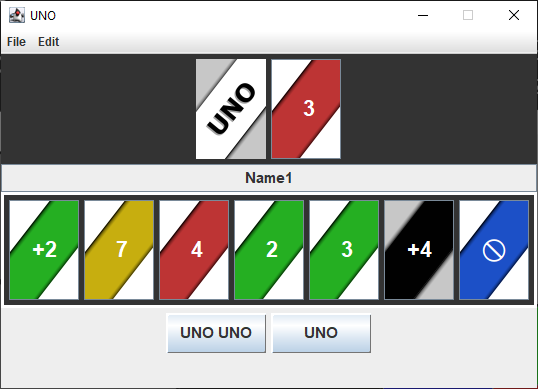

# Uno

# Installation

## Native
1. Install Scala3 and sbt
2. Go to project directory `cd uno`
3. Run the Game `sbt run`
### Note for Windows
run `chcp 65001` to enable needed UTF-8 compatibility

## Docker
1. Go to project directory: `cd uno`
2. Build the Image `docker build -t uno:v1 .` <-- Notice the dot
3. Run the Game `docker run -it --rm uno:v1`
### Note for Windows
You need a Linux X Window System Server on your Windows
We recommend using Xming [

# TUI commands and example
Command | Description 
--------|--------
quit      / q          | quits the program
t                      | takes a card from stack
r                      | drop card
undo                   | undos the last command
redo                   | redos the last undo command
save                   | save the Gamestate
load                   | load the Gamestate
uno       / u          | call uno
uno uno  / uu          | call uno uno

# GUI
  ## Ingame Screen
   